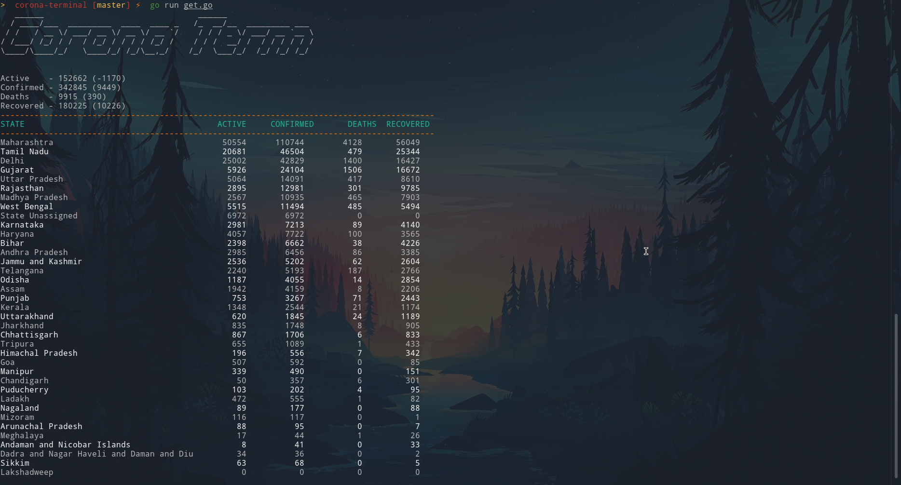

# covid-term

The coolest terminal application for corona stats (Corona Term).

## Installation
1. Install Go
2. Install figlet (for the fancy heading):
    - Ubuntu - `sudo apt-get install figlet`
    - Manjaro/Arch - `sudo pacman -S figlet`
3. `go run get.go`

The program saves details for each day as "date.csv" i.e 2020-06-23.csv for 
example everytime it is run.\
(can hoard data and try some visualization later)

## Screenshot

#### Works on Windows(terminal/cmd) as well without the fancy heading 

